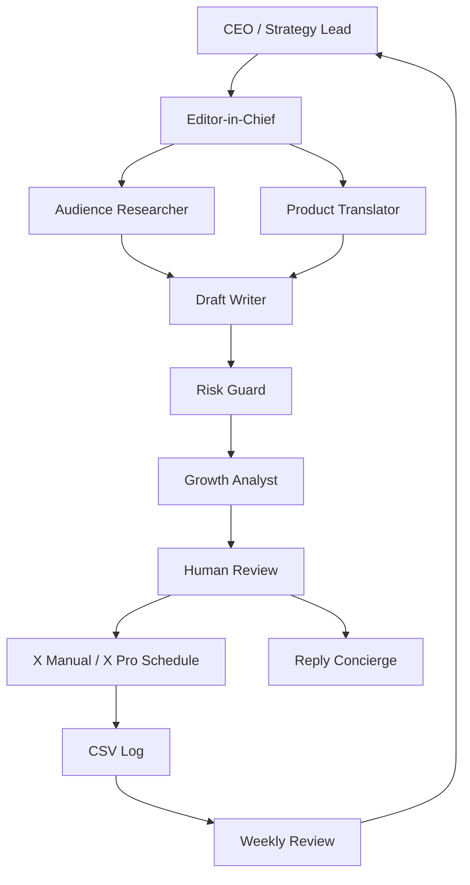

# PachiTracker X Growth Org 統合戦略設計書

## 1. 結論

PachiTrackerのX運用は、「バズる投稿をAIに作らせる」ではなく、**PachiTracker専用の小さな編集部をリポジトリ内に作る**形が最も合理的です。

理由は3つです。

1. Xは単純なインプレッションだけでなく、クリック、プロフィール遷移、返信、信頼性、低品質判定の影響を受けるため、煽り型の単発バズは資産化しにくい。
2. PachiTrackerはギャンブル文脈を含むため、「勝てる」「稼げる」方向に寄せると、信頼・規約・景表法のリスクが上がる。
3. Claude Code / Codex のSkill・Subagentを使えば、追加API課金なしで、ネタ収集、投稿生成、リスク判定、採点、週次改善まで分業できる。

したがって、MVPでは以下の方針にする。

```text
本文完結型 + スクショ証拠型 + プロフィール遷移重視 + CSVログ改善
```

## 2. PachiTrackerのXポジショニング

### 一言定義

PachiTrackerは、パチンコの台選び・続行・撤退判断を記録し、後から見直すための判断ログアプリ。

### コアメッセージ

```text
感覚ではなく、判断ログで打つ。
```

### Xで見せるべき姿

- 勝ち自慢アプリではない
- 必勝法アプリではない
- 収支報告SNSではない
- 感情で崩れる判断を、記録で見直すアプリ
- 現場の迷いをUIとデータで減らす個人開発プロダクト

## 3. AI組織型運用の基本思想

会社組織のように役割分担する理由は、AIをたくさん動かすためではありません。**投稿の失敗原因を分解するため**です。

投稿が伸びない原因は、だいたい次のどれかです。

- ネタが読者の痛みに届いていない
- 1行目が弱い
- 投稿が説明文になっている
- 売り込み臭い
- PachiTrackerとの接続が弱い
- リスク表現がある
- いいねは取れるがプロフィール遷移しない
- 投稿後の返信導線がない

これを1人のAIに全部やらせると、評価が甘くなります。そこで役割を分ける。

## 4. AI組織図



### CEO / Strategy Lead

目的とKPIを決める。毎週の重点を決める役割。

判断基準：

- 今週はフォロワー獲得か、β候補獲得か、UI認知か
- インプレッションではなく、プロフィール遷移とフォローを優先できているか
- PachiTrackerの世界観からズレていないか

### Editor-in-Chief

投稿テーマと型を選ぶ編集長。

判断基準：

- 問題提起型か
- あるある型か
- 失敗告白型か
- UIスクショ型か
- 検証メモ型か
- β募集型か

### Audience Researcher

読者の痛みを抽出する役割。

主な痛み：

- 昨日出ていた台に座ってしまう
- 前半だけ回った記憶を引きずる
- 投資したからヤメられない
- 感覚で続行して後悔する
- 勝った日の記憶だけ残る
- 店舗傾向を覚えているつもりで外す
- 記録しないので反省が毎回感情論になる

### Product Translator

機能をそのまま説明せず、ユーザーの判断ミスに変換する役割。

悪い変換：

```text
回転率分析機能を実装しました。
```

良い変換：

```text
「回ってる気がする」を、あとで数字で見直せるようにしました。
```

### Draft Writer

投稿案を3〜5案作る役割。

ルール：

- 1行目で止める
- 140字以内を基本
- 日本語は短く
- アプリ名は最後に軽く
- 売り込み臭を避ける
- 0〜2ハッシュタグ

### Risk Guard

表現リスクを落とす役割。

落とすもの：

- 絶対勝てる
- 勝率爆上げ
- 誰でも稼げる
- 必勝
- 攻略法
- 最強
- 革命
- 他社より確実に優秀
- 未実装機能の断定
- 内部ロジック漏洩

### Growth Analyst

投稿前スコアと投稿後スコアを評価する役割。

重視する順番：

1. プロフィール遷移率
2. フォロー率
3. 返信率
4. リポスト率
5. ブックマーク率
6. いいね率
7. インプレッション

### Reply Concierge

投稿後の返信案を作る役割。ただし自動返信はしない。

良い返信：

- 相手の体験を深掘りする
- PachiTrackerの思想につなげる
- 売り込まない
- 「それ分かります」で終わらせない

## 5. 投稿レーン設計

### Lane A: 判断ミス問題提起

目的：共感、返信、プロフィール遷移。

型：

```text
パチンコで負ける原因は、
〇〇だけじゃない。

本当に怖いのは、
△△してしまうこと。

この判断を後から見直すために、
PachiTrackerを作っています。
```

### Lane B: あるある観察

目的：軽い拡散、会話化。

型：

```text
これ、やりがち。

・昨日出ていた台に座る
・前半回った記憶で続ける
・投資したからヤメられない

全部、判断が歪んでいるサイン。
```

### Lane C: 失敗告白

目的：人間味、信頼形成。

型：

```text
自分で記録アプリを作っているのに、
記録をサボって判断ミスしました。

だから、入力をもっと軽くする必要がある。

便利な機能より、続く設計を優先します。
```

### Lane D: UIスクショ証拠

目的：プロフィール遷移、プロダクト理解。

型：

```text
入力が面倒だと、
正しい判断より「楽な判断」を選ぶ。

だからPachiTrackerは、
実戦中に迷わない入力導線を優先しています。
```

添付画像：

- UI改善前後
- 記録画面
- 収支カード
- 判断ログ画面
- 月別サマリー

### Lane E: 検証メモ・数字提示

目的：信頼、保存、リポスト。

型：

```text
感覚で「回ってる」と思った台ほど、
あとで記録を見るとブレていることが多い。

記憶ではなく、
数字で振り返る癖を作りたい。
```

### Lane F: β募集

目的：見込みユーザー獲得。

型：

```text
パチンコの台選び・続行・撤退を、
感覚ではなく記録で見直したい人向けに
PachiTrackerを作っています。

β版を触ってくれる人を少人数で募集予定です。
```

## 6. 投稿比率

### Phase 0: MVP前 / フォロワー50人未満

```text
問題提起      35%
あるある      20%
失敗告白      20%
UIスクショ    15%
β募集         10%
```

### Phase 1: β版準備 / フォロワー50〜150人

```text
問題提起      25%
UIスクショ    25%
失敗告白      20%
検証メモ      15%
β募集         15%
```

### Phase 2: β版開始 / フォロワー150人以上

```text
UIスクショ    25%
β募集         25%
検証メモ      20%
問題提起      15%
ユーザーの声  15%
```

## 7. A/Bテスト設計（型×時間帯ローテーション）

> ⚠️ 検証設計の鉄則: **1度に変える変数は1つ**。そして **1週内で朝/昼/夜を直接比較しない**。
> 1週内では「時間帯」と「型」が交絡する（朝＝問題提起、夜＝UI…のように固定すると、
> 夜が伸びても「夜だから」か「UIだから」か切り分けられない）。

各型を週ごとに別スロットへローテーションし、**同じ型の時間帯差を週またぎで比較**する。
具体的な割り当ては `data/ab_test_plan.csv` を単一の正とする。

| post_type | W1 | W2 | W3 | 3週で分かること |
|---|---|---|---|---|
| 問題提起型 | 朝 | 夜 | 昼 | 問題提起はどの時間帯が遷移率最大か |
| あるある型 | 昼 | 朝 | 夜 | あるあるの最適スロット |
| 失敗告白型 | 朝 | 昼 | 夜 | 失敗告白の最適スロット |
| UIスクショ型 | 夜 | 昼 | 朝 | UIスクショの最適スロット（画像は常に付け固定） |

時間帯の検証が一巡したら、次は **1行目フック → 画像有無 → CTAの強さ** の順で、
やはり「1週1変数・他は固定」で回す。評価指標は profile_visit_rate を主、
follow_conv_rate（= follows_gained / profile_visits）を副とする。

## 8. 時間帯の初期仮説

PachiTrackerは一般ビジネスアカウントではなく、パチンコ実戦者と個人開発者の混合です。よって、一般論だけで朝に固定しない。

初期は次の3枠で検証する。

```text
朝 08:00〜09:30  分析・開発・思想
昼 12:00〜13:00  軽いあるある
夜 21:00〜22:30  パチンコ実戦者向け・β募集・UI相談
```

結論は4週間のCSVログで上書きする。

## 9. 週次運用

### 毎日 15分

```text
1. ネタを1〜3個追加
2. 投稿候補を3案生成
3. リスクチェック
4. スコアリング
5. 1本だけ承認
6. Xで手動投稿または予約
```

### 週1回 45分

```text
1. post_log.csv を更新
2. 上位3投稿を確認
3. 下位3投稿を確認
4. 勝ちフックを抽出
5. 負けパターンを禁止/注意リストへ追加
6. 次週のA/B仮説を1つだけ決める
```

### 月1回 90分

```text
1. 投稿レーン比率を見直す
2. プロフィール文を見直す
3. 固定ポストを見直す
4. β導線を見直す
5. リポジトリのルールを更新する
```

## 10. コスト方針

MVPでは追加課金を避ける。

やらない：

- X APIによる自動投稿
- ブラウザ操作の自動化
- 自動いいね
- 自動フォロー
- 外部SaaSによる分析
- LangChain social-media-agentのフル導入

やる：

- Claude Code / Codexの月額枠内で下書き生成
- 手動投稿またはX Pro予約投稿
- CSVログ
- MarkdownベースのSkill
- Pythonの軽量スクリプト

## 11. 完成判定

このリポジトリは、以下を満たせばMVP完成。

- 投稿候補を毎週5〜10本作れる
- 投稿前にリスクチェックできる
- 投稿前に100点採点できる
- 140字以内判定できる
- CSVログにKPIを残せる
- 週次レビューで勝ち型を更新できる
- 追加API課金なしで回る
- PachiTrackerの思想からズレない

## 12. 最終判断

PachiTrackerのX運用で最初に作るべきものは、外部SNS自動化ツールではありません。

最初に作るべきものは、**Claude Code / Codexから呼び出せる、PachiTracker専用の編集部リポジトリ**です。

この構成なら、追加課金を増やさず、X規約リスクを抑えながら、投稿作成・採点・改善を継続できます。
